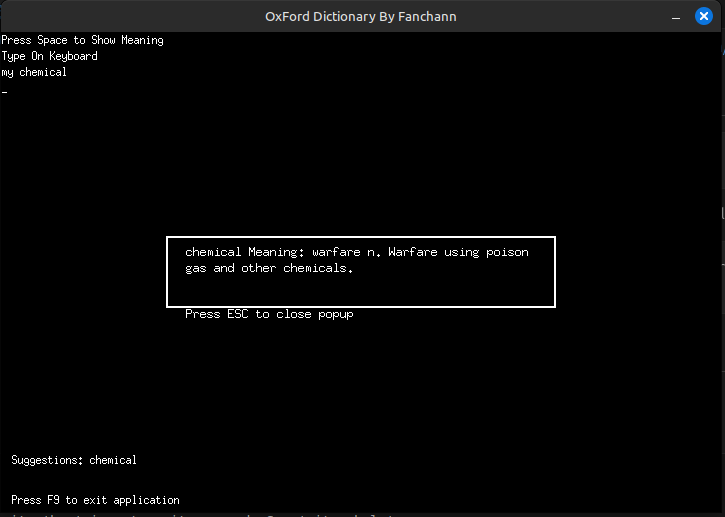

## GOWOR
find words in dictionary\
dictionary source:
- https://github.com/sujithps/Dictionary

## FYI
- This project is written in Go language
- This project is using ebiten library for GUI
- This project was implement trie data structure

Feature:
- Search word by typing
- Show suggestions
- Show meaning

## How to run?
First you need to clone this project:
```bash
git clone https://github.com/fanchann/gowor.git
```

Then you need to install dependencies:
```bash
cd gowor
go mod download
```

You can run this project by:
```bash
go run main.go
```

Or you can build binary file:
```bash
go build -o gowor main.go
./gowor
```

## Screenshot

